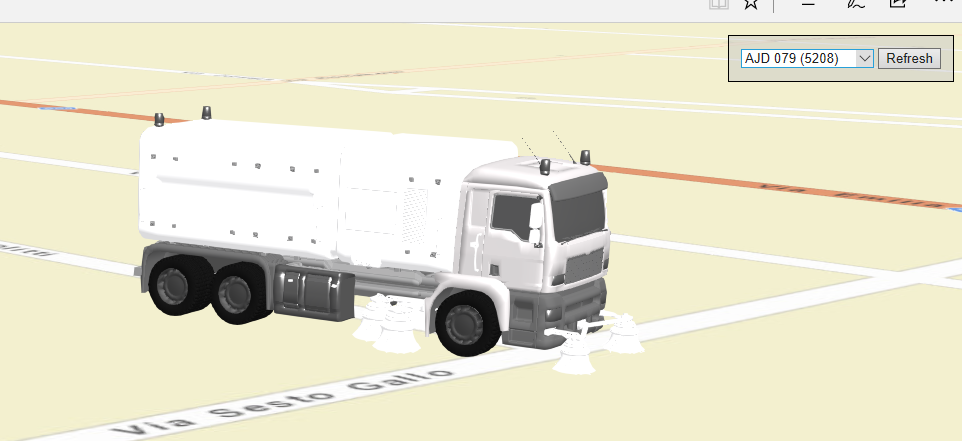

## ArcGIS Javascript API Samples using WebGL

Samples [forked](https://github.com/jkieboom/devsummit-palm-springs-2017) from DS2017

[Sample 0](https://nicogis.github.io/WebGL/)
Description: loads a collada model (a sweeper). Click on map and wait. Rotate the model with key 'r'. Event 'Mouse move' moves the model.

[Sample 1](https://nicogis.github.io/WebGL/index01.html)
Description: visualizes ECEF coordinate system. See for details this [link](https://developers.arcgis.com/javascript/latest/api-reference/esri-views-3d-externalRenderers.html).

[Sample 2](https://nicogis.github.io/WebGL/index02.html)
Description: Camera and lighting.

[Sample 3](https://nicogis.github.io/WebGL/index03.html)
Description: Precision.

[Sample 4](https://nicogis.github.io/WebGL/index04.html)
Description: three.js. Adds box three.js in scene.

[Sample 5](https://nicogis.github.io/WebGL/index05.html)
Description: Animation.

[Sample 6](https://nicogis.github.io/WebGL/index06.html)
Description: Video texture. Drags with CTRL key for create a box texture.

[Sample 7](https://nicogis.github.io/WebGL/index07.html)
Description: Flow.

[Sample 8](https://nicogis.github.io/WebGL/Sweeper.html)
Description: Loads collada model (a sweeper) with three.js.

[Sample Esri](https://maps.esri.com/jg/threejs/external-renderer-sample/index.html)
Description: External Renderers

[Tectonic](https://jkieboom.github.io/devsummit-palm-springs-2018/demos/tectonic/)
Description: Tectonic (dev summit 2018)

[Latest Winds and Temperatures](https://maps.esri.com/jg/CurrentWind/index.html)
Description: Latest Winds and Temperatures

[Airports](https://maps.esri.com/jg/Airports/index.html)
Description: US Airports Locations

[Esri's Applications Prototype Lab](https://maps.esri.com/portal/WebApps/index.html)
Description: Samples from Esri’s Applications Prototype Lab

Useful links:
- [External Renderer with API JS ArcGIS](https://developers.arcgis.com/javascript/latest/api-reference/esri-views-3d-externalRenderers.html)
- [Three.js](https://threejs.org/)
- [WebGL](https://webglfundamentals.org)

